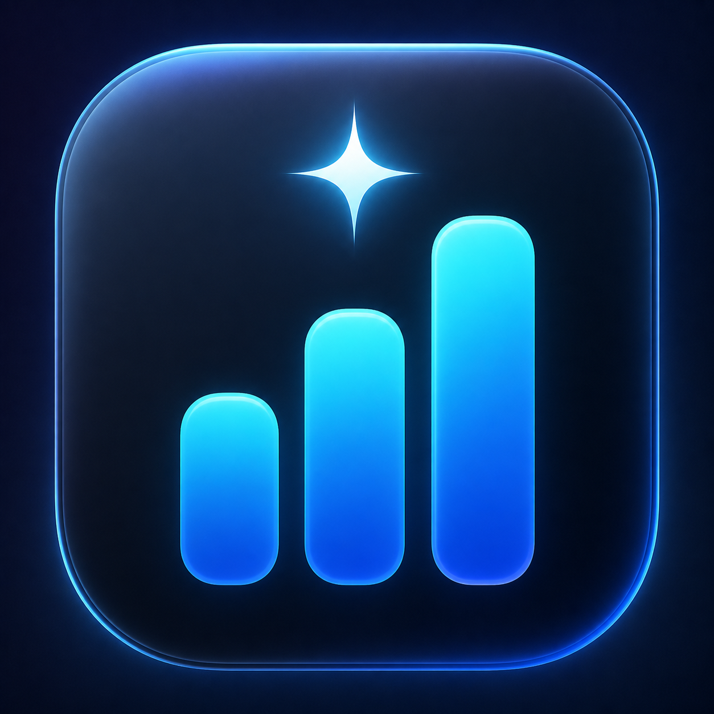
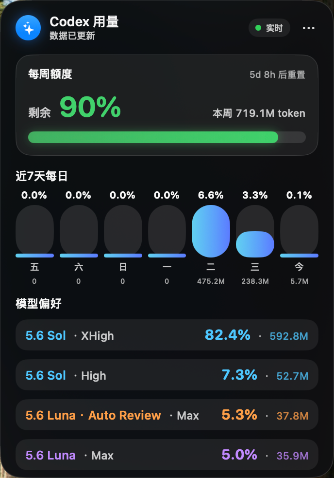
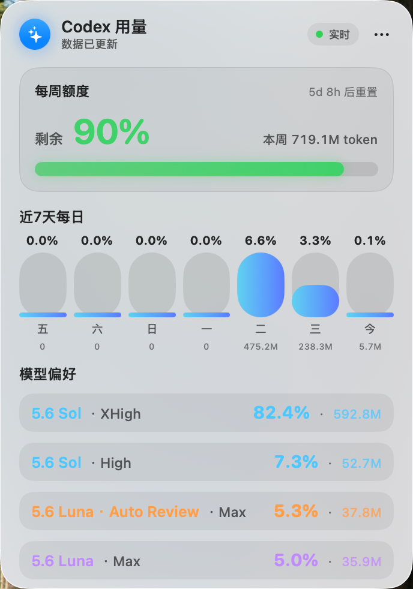

<div align="center">

# ✦ CodexMeter

### Native Codex usage visualization for Windows and macOS

[简体中文](README.md) · English

[](windows/README.zh-CN.md)
[](https://www.apple.com/macos/)
[](https://www.swift.org/)
[](https://github.com/steipete/CodexBar)
[](LICENSE)
[](https://github.com/xumanba/codex-meter/releases)

Visualize your remaining Codex allowance, rate-limit windows, pacing and reset
time on Windows, or use the detailed current-quota token view on macOS.

</div>

<p align="center">
  
</p>

> [!IMPORTANT]
> **CodexMeter supports both Windows and macOS.** Windows v0.1.1 uses the
> native WinForms client and an installed Win-CodexBar CLI. macOS v0.2.0 uses
> the SwiftUI/AppKit client, bundles the verified CodexBar CLI and adds detailed
> current-quota token usage. Neither client stores account credentials.

> [!NOTE]
> The `main` branch now contains the complete Windows v0.1.1 and macOS v0.2.0
> source lines. The packaged macOS application remains available from the
> [v0.2.0 Release](https://github.com/xumanba/codex-meter/releases/tag/v0.2.0).

> [!TIP]
> **Signature feature — left/right edge docking.** Drag CodexMeter to either
> side of a display and it tucks itself away as a narrow glass strip. Touch the
> edge to reveal the full usage meter; move away and it smoothly hides again.

## Platform support

| Platform | Native UI | Release / install | Data provider |
|---|---|---|---|
| Windows 10/11 | WinForms + DWM, Per-Monitor V2 DPI | `Codex-Meter-Windows-portable-v0.1.1.zip` | [Win-CodexBar](https://github.com/Finesssee/Win-CodexBar) CLI |
| macOS 14+ | SwiftUI + AppKit | [`CodexMeter-macos-universal-0.2.0.zip`](https://github.com/xumanba/codex-meter/releases/download/v0.2.0/CodexMeter-macos-universal-0.2.0.zip) | Bundled CodexBar CLI |

Windows-specific build, install and troubleshooting instructions are available
in [`windows/README.zh-CN.md`](windows/README.zh-CN.md). See the bilingual
[`VERSION-GUIDE.md`](VERSION-GUIDE.md) for separate Windows/macOS downloads and
the differences between Windows v0.1.0/v0.1.1 and macOS v0.2.0.

## Codex usage and quota visualization

CodexMeter is a native Windows and macOS floating widget for people searching for a
**Codex usage monitor**, **Codex quota visualization**, **Codex rate-limit
tracker** or a visual view of **Codex token usage capacity**. It shows the
allowance and rate-window data available through CodexBar; it does not claim to
count the raw tokens used by each individual prompt.

- Remaining weekly Codex allowance and reset time
- On macOS v0.2.0, current-quota daily token usage for the latest seven days
- On macOS v0.2.0, model preference split by model, reasoning effort and Fast mode
- Reasoning effort labels use the UI spelling `None`, `Low`, `Medium`, `High`, `xHigh` and `Max`
- On macOS v0.2.0, weekly pace compares actual usage with time-based expected usage,
  marks normal/fast/slow pacing and shows an estimated depletion time when available
- Additional Codex Spark rate windows when available
- Optional always-on-top visualization with optional Codex app following
- QQ-style left/right edge auto-hide with native hover reveal

## Current interface previews

<table>
  <tr>
    <th align="center">Dark interface</th>
    <th align="center">Light interface</th>
  </tr>
  <tr>
    <td></td>
    <td></td>
  </tr>
</table>

Both themes are designed for legibility and use native platform materials,
typography, rounded geometry and system-inspired colors. Your last theme
selection is restored automatically on both systems.

## Highlights

- **Instant edge shelf** — tuck the card into either side of any display, then
  reveal it with a near-instant native hover animation.
- **Always visible** — floats above normal windows and follows every Space.
- **Remaining allowance** — shows what is left, rather than what has been used.
- **macOS daily token view** — v0.2.0 shows current-quota daily percentages and
  token amounts across the latest seven calendar days.
- **macOS model preference** — keeps each model, reasoning effort and Fast mode
  separate, with percentage first and token amount second.
- **Refresh-bound model preference** — clears model totals when the quota reset
  is detected, then counts only usage after that refresh.
- **macOS whole-number quota** — weekly remaining percentage follows Codex's
  integer precision and does not invent decimal values.
- **macOS weekly pace** — marks the time-based expected usage position on the
  weekly bar and compares actual versus expected usage as normal, fast or slow.
- **Native app branding** — the floating card header uses the CodexMeter app
  icon bundled with the macOS application.
- **Pace awareness** — displays over-pace percentage, expected depletion time
  and a red pacing marker.
- **Clear reset timing on Windows** — uses the same `xd xh` countdown for
  weekly and Spark allowances, prevents early hour truncation and exposes exact
  reset times on hover.
- **Codex Spark support** — automatically shows extra Codex rate windows.
- **Two native glass themes** — switch between dark and light from the menu.
- **Position memory** — drag the card anywhere; its fixed position is restored.
- **Optional Codex following** — show only while Codex is the foreground app.
- **Tray mode on Windows** — minimize the card to the notification area and
  restore it from the tray menu.
- **Instant manual sync** — click the status pill or choose the menu action to
  refresh allowance, reset and pacing data immediately; hover the pill to see
  the latest data-update time in a progress-bar-matched prompt.
- **Live network speed on Windows** — shows aggregate download and upload speed
  from active network adapters once per second, without inspecting packet data.
- **Private by design** — never displays or stores account credentials.
- **Adaptive refresh on Windows** — refreshes less often while hidden and backs
  off after failures; macOS refreshes once per minute.

## Requirements

### Windows

- Windows 10 or Windows 11
- .NET Framework 4.7.2 or newer (included with supported Windows versions)
- [Win-CodexBar](https://github.com/Finesssee/Win-CodexBar), installed and
  signed in so that `codexbar-cli.exe` can read Codex usage

### macOS

- macOS 14 Sonoma or newer
- A Codex account already signed in on this Mac

CodexMeter reads the same local OAuth session used by Codex. If you have not
signed in yet, open the Codex app or run:

```bash
codex login
```

The macOS build can bundle CodexBar, so a separate CodexBar installation is not
required for the packaged macOS application.

## Download and install

### Windows v0.1.1

1. Install and sign in to Win-CodexBar.
2. Download [`Codex-Meter-Windows-portable-v0.1.1.zip`](https://github.com/xumanba/codex-meter/releases/download/v0.1.1/Codex-Meter-Windows-portable-v0.1.1.zip).
3. Extract the ZIP, open `Codex Meter Windows v0.1.1`, and run `CodexMeter.exe`.
4. Windows may show an unknown-publisher warning because the community binary
   is not Authenticode-signed. Review the source or build locally if required.

Direct portable use does not modify the registry or enable startup. The ZIP
also includes opt-in install and uninstall scripts. Settings
are stored under `%LOCALAPPDATA%\CodexMeter` and contain no credentials.
Before upgrading a script-installed copy, exit CodexMeter from the system tray
and run the new `install.ps1`; the installer now detects a running installed
copy and stops with a clear message instead of attempting to replace it.

### macOS v0.2.0

Download `CodexMeter-macos-universal-0.2.0.zip` from the v0.2.0 Release, open the
ZIP and move **CodexMeter.app** to Applications. The package is ad-hoc signed,
not Apple-notarized: Control-click the app and choose **Open** the first time,
or approve it under **System Settings → Privacy & Security**.

The macOS v0.2.0 application includes both `arm64` and `x86_64` slices and
includes the CodexMeter app icon.

### Install macOS from source

Building from source requires the Apple Swift 6 toolchain and network access to
download the pinned, checksum-verified CodexBar CLI release:

```bash
git clone https://github.com/xumanba/codex-meter.git
cd codex-meter
chmod +x install.sh uninstall.sh build-app.sh
./install.sh
```

The installer:

1. builds an ad-hoc signed native macOS application;
2. bundles the verified CodexBar CLI;
3. installs it as `/Applications/CodexMeter.app` for the macOS v0.2.0 build;
4. creates a per-user LaunchAgent;
5. launches the meter in the background without hiding its window.

No administrator password is normally required when your user can write to
`/Applications`.

## Using the meter

Drag the card to place it anywhere. Open the `•••` menu to:

- choose **固定在桌面** to keep it pinned above normal windows;
- choose **跟随 Codex** to show it only when Codex is active;
- toggle **始终置顶** independently from the display mode;
- switch between **深色玻璃** and **浅色玻璃**;
- click the status pill or choose **立即同步** to refresh immediately;
- choose **最小化到托盘** on Windows to keep only the notification icon;
- quit the application.

The selected theme and fixed position are saved with macOS `UserDefaults` or
the Windows `%LOCALAPPDATA%\CodexMeter\settings.ini` file.

### Edge shelf

Drag the card close to the left or right edge and release it. The meter slides
out of the way while leaving a narrow glass strip:

```text
drag to edge → tucked strip → hover ~0.02s → reveal
move away   → wait ~0.18s  → smooth re-hide
```

- **Fast by design** — native timers and short animations keep reveal latency
  low without repainting the whole card continuously.
- **Multi-display aware** — macOS uses AppKit tracking and Windows uses
  Per-Monitor V2 DPI-aware edge geometry.
- **Position memory** — the selected display, edge and vertical position are
  restored after relaunch.
- **Easy to release** — drag the revealed card away from the edge to return to
  normal floating mode.
- **No extra permission** — edge reveal does not require Accessibility access.

## How it works

### Windows

```text
Codex / OpenAI account
          │
          ▼
  Win-CodexBar CLI (on demand)
          │  JSON stdout
          ▼
  CodexMeter (WinForms + DWM)
          ├── adaptive refresh and stale-data state
          ├── remaining allowance and reset time
          ├── edge docking and tray mode
          └── no stored credentials
```

The Windows process launches the local CLI only for a refresh, applies a hard
timeout and cancellation, sanitizes provider errors, and keeps the last valid
snapshot when a later refresh fails.

The Windows network tile reports aggregate operating-system traffic across
active non-loopback, non-tunnel adapters. It is a system-wide activity hint,
not a measurement of Codex-only traffic. Depletion time is a cumulative-average
estimate and is withheld until enough of the current quota window has elapsed.

### macOS

```text
Codex / OpenAI account
          │
          ▼
  Bundled CodexBar CLI
          │  localhost JSON, port 18747
          ▼
  CodexMeter (SwiftUI + AppKit)
          │
          ├── remaining weekly allowance
          ├── current-quota daily token scan (v0.2.0)
          ├── model / effort / Fast breakdown (v0.2.0)
          └── native floating NSPanel
```

The macOS v0.2.0 release starts its bundled `codexbar serve` helper on
`127.0.0.1:18747` when needed and polls the local endpoint every 60 seconds.
Its token scanner groups local Codex session records by current quota window,
day, model, reasoning effort and Fast mode. The server is not exposed to your
network.

## Build manually

### Windows

```powershell
.\windows\build.ps1
.\windows\dist\CodexMeter.Tests.exe
.\windows\package-release.ps1 -Version 0.1.1
```

The Windows build uses the .NET Framework compiler already present on Windows
and downloads no NuGet dependencies. The Release script verifies the executable
version, runs the test suite, checks ZIP contents and prints SHA-256 hashes.

### macOS v0.2.0 release line

```bash
git clone https://github.com/xumanba/codex-meter.git
cd codex-meter
chmod +x build-app.sh
./build-app.sh
open ".build/CodexMeter.app"
```

The project intentionally uses Swift Package Manager and AppKit/SwiftUI only.
The build downloads the pinned CodexBar CLI `v0.45.2` assets from the official
release, verifies their published SHA-256 values, and bundles the requested
architecture. The main source creates the same universal package published on
GitHub with:

```bash
./Scripts/package-release.sh
```

The edge interaction uses AppKit's native mouse tracking and does not need
Accessibility permission. The compact edge-reveal approach was informed by
[SideTerminal](https://github.com/bunnysayzz/sideterminal), an MIT-licensed
open-source macOS project. CodexMeter implements its own compact-card geometry
and multi-display position memory.

## Uninstall

For the downloaded Release, quit CodexMeter and move it from Applications to
Trash.

For an installation made with `install.sh`, run:

```bash
./uninstall.sh
```

The application and LaunchAgent are moved to Trash. Your Codex login and
settings are left untouched.

## Relationship to CodexBar

This project is an **independent, unofficial application** powered by
[steipete/CodexBar](https://github.com/steipete/CodexBar). Release packages
redistribute the official CodexBar CLI `v0.45.2` binary under its
[MIT License](ThirdPartyLicenses/CodexBar-LICENSE.txt), including the complete
copyright and permission notice inside the app bundle.

CodexMeter does not redistribute CodexBar icons or present itself as an
official CodexBar product. This repository is not affiliated with or endorsed
by CodexBar, OpenAI or Apple. See [NOTICE](NOTICE) for attribution details.

## Security and privacy

- On macOS, the floating interface talks only to its helper on `127.0.0.1`.
- On Windows, each refresh directly starts the approved local
  `codexbar-cli.exe`; the meter does not expose a listening port.
- The Windows network-speed display reads only operating-system byte counters;
  it does not capture packets, inspect destinations or require administrator access.
- CodexBar reads the existing Codex OAuth session from the user's local Codex
  configuration and requests that account's usage data.
- CodexMeter does not copy, display or bundle passwords, OAuth tokens, cookies
  or account emails.
- Screenshots in this repository contain usage percentages only.
- The v0.2.0 macOS build is ad-hoc signed but not Apple-notarized. The v0.1.1
  Windows binary is currently not Authenticode-signed. Both systems may therefore
  require explicit approval on first launch; review the source if required.

## Documentation maintenance

The Chinese README is the primary project documentation. Every future feature,
statistics or interface change should update this README, `README.en.md` and the
corresponding screenshots/assets together.

## License

CodexMeter is available under the [MIT License](LICENSE).

---

<div align="center">
Built for people who want their remaining context visible at a glance.
</div>
