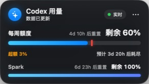
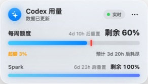

<div align="center">

# ✦ Codex Meter

### Native macOS Codex usage visualization, quota monitor and edge-docking widget

[](https://www.apple.com/macos/)
[](https://www.swift.org/)
[](https://github.com/steipete/CodexBar)
[](LICENSE)
[](https://github.com/xumanba/codex-meter/releases/tag/v0.2.0)

Visualize your remaining Codex allowance, current-quota token usage, daily
usage and model preference without leaving your workspace.

</div>

> [!IMPORTANT]
> **One download, no separate CodexBar installation.** The universal Release
> package includes the verified CodexBar CLI for both Apple silicon and Intel
> Macs. It uses your existing local Codex login and never bundles credentials.

> [!NOTE]
> **v0.2.0 is macOS-only.** This release targets macOS 14 Sonoma or newer and
> does not include or support the Windows build.

> [!TIP]
> **Signature feature — instant left/right edge docking.** Drag Codex Meter to
> either side of any display and it tucks itself away as a subtle 5-point glass
> strip. Touch the edge to reveal the full usage meter in about 0.02 seconds;
> move away and it smoothly hides again.

## Codex usage and quota visualization

Codex Meter is a native macOS floating widget for people searching for a
**Codex usage monitor**, **Codex quota visualization**, **Codex rate-limit
tracker** or a visual view of **Codex token usage capacity**. It combines the
allowance data available through CodexBar with local Codex session usage records
to present a compact current-quota view.

- Remaining weekly Codex allowance and reset time
- Current-quota daily usage for the latest seven calendar days
- Token totals and quota percentages for each active day
- Model preference split by model, reasoning effort and Fast mode
- Always-on-top visualization with optional Codex app following
- QQ-style left/right edge auto-hide with native hover reveal

## Glass themes

<table>
  <tr>
    <th align="center">Dark glass</th>
    <th align="center">Light glass</th>
  </tr>
  <tr>
    <td></td>
    <td></td>
  </tr>
</table>

Both themes are designed for legibility and use native macOS materials,
typography, rounded geometry and system-inspired colors. Your last theme
selection is restored automatically.

## Highlights

- **Instant edge shelf** — tuck the card into either side of any display, then
  reveal it with a near-instant native hover animation.
- **Always visible** — floats above normal windows and follows every Space.
- **Remaining allowance** — shows what is left, rather than what has been used.
- **Daily token view** — shows the current quota window's daily percentage and
  token amount across the latest seven calendar days.
- **Model preference** — keeps each model, reasoning effort and Fast mode as a
  separate usage row and emphasizes percentage before token amount.
- **Two native glass themes** — switch between dark and light from the menu.
- **Position memory** — drag the card anywhere; its fixed position is restored.
- **Optional Codex following** — show only while Codex is the foreground app.
- **Private by design** — reads only a localhost endpoint and never displays or
  stores account credentials.
- **One-minute refresh** — updates every 60 seconds, with an instant manual
  refresh action.

## What's new in v0.2.0

- Reworked the floating card around weekly remaining percentage, a color-coded
  quota bar and compact current-period token totals.
- Added a latest-seven-days view with both token amounts and each day's share of
  the current weekly quota.
- Daily usage follows the current quota window: dates before the latest quota
  refresh are shown as `0 token / 0%`; on a day that refreshes mid-day, only
  usage after the refresh is counted.
- Added model preference rows separated by model, reasoning effort and Fast
  mode, with percentage-first display and model-specific colors.
- Model rows now determine the panel height. The card grows as models appear
  and becomes internally scrollable only after reaching the available screen
  height.
- Tightened the glass surface clipping so the rounded card no longer leaves a
  rectangular shadow or translucent corner artifacts.
- This release is for macOS users only; Windows support remains outside v0.2.0.

## Requirements

- macOS 14 Sonoma or newer
- A Codex account already signed in on this Mac

The v0.2.0 release is macOS-only. Windows is not supported by this version.

Codex Meter reads the same local OAuth session used by Codex. If you have not
signed in yet, open the Codex app or run:

```bash
codex login
```

You do **not** need to install CodexBar separately.

## Download and install

1. Download `Codex-Meter-macos-universal-0.2.0.zip` from
   [GitHub Releases](https://github.com/xumanba/codex-meter/releases/tag/v0.2.0).
2. Open the ZIP and move **Codex Meter.app** to Applications.
3. Because this free preview is not Apple-notarized, Control-click the app and
   choose **Open** the first time. If macOS still blocks it, go to **System
   Settings → Privacy & Security** and choose **Open Anyway**.
4. Open Codex Meter. Your floating usage card appears immediately when your
   local Codex login is valid.

The Release is ad-hoc signed and includes both `arm64` and `x86_64` slices. No
administrator password or separate CodexBar installation is required.

### Install from source

Building from source requires the Apple Swift 6 toolchain and network access to
download the pinned, checksum-verified CodexBar CLI release:

```bash
git clone https://github.com/xumanba/codex-meter.git
cd codex-meter
chmod +x install.sh uninstall.sh build-app.sh
./install.sh
```

The installer:

1. builds an ad-hoc signed native macOS application;
2. bundles the verified CodexBar CLI;
3. installs it as `/Applications/Codex Meter.app`;
4. creates a per-user LaunchAgent;
5. launches the meter in the background without hiding its window.

No administrator password is normally required when your user can write to
`/Applications`.

## Using the meter

Drag the card to place it anywhere. Open the `•••` menu to:

- choose **固定在桌面** to keep it pinned above normal windows;
- choose **跟随 Codex** to show it only when Codex is active;
- switch between **深色玻璃** and **浅色玻璃**;
- refresh immediately;
- quit the application.

The selected theme and fixed position are saved with macOS `UserDefaults`.

### Edge shelf

Drag the card close to the left or right edge and release it. The meter slides
out of the way while leaving a subtle 5-point glass strip:

```text
drag to edge → tucked strip → hover ~0.02s → reveal
move away   → wait ~0.18s  → smooth re-hide
```

- **Fast by design** — the slide animation completes in about 0.12 seconds.
- **Native and reliable** — AppKit mouse-enter/exit tracking replaces global
  cursor polling, including on multi-display setups.
- **Position memory** — the selected display, edge and vertical position are
  restored after relaunch.
- **Easy to release** — drag the revealed card away from the edge to return to
  normal floating mode.
- **No extra permission** — edge reveal does not require Accessibility access.

## How it works

```text
Codex / OpenAI account
          │
          ▼
  Bundled CodexBar CLI
          │  localhost JSON, port 18747
          ▼
  Codex Meter (SwiftUI + AppKit)
          │
          ├── remaining weekly allowance
          ├── current-quota daily token scan
          ├── model / effort / Fast breakdown
          └── native floating NSPanel
```

Codex Meter starts its bundled `codexbar serve` helper on `127.0.0.1:18747`
when needed and polls the local endpoint every 60 seconds. The v0.2.0 token
scanner also reads local Codex session records to group token usage by the
current quota window, day, model, reasoning effort and Fast mode. It does not
send those local records anywhere. The server is not exposed to your network.

## Build manually

```bash
chmod +x build-app.sh
./build-app.sh
open ".build/Codex Meter.app"
```

The project intentionally uses Swift Package Manager and AppKit/SwiftUI only.
The build downloads the pinned CodexBar CLI `v0.45.2` assets from the official
release, verifies their published SHA-256 values, and bundles the requested
architecture. Create the same universal package published on GitHub with:

```bash
./Scripts/package-release.sh
```

The edge interaction uses AppKit's native mouse tracking and does not need
Accessibility permission. The compact edge-reveal approach was informed by
[SideTerminal](https://github.com/bunnysayzz/sideterminal), an MIT-licensed
open-source macOS project. Codex Meter implements its own compact-card geometry
and multi-display position memory.

## Uninstall

For the downloaded Release, quit Codex Meter and move it from Applications to
Trash.

For an installation made with `install.sh`, run:

```bash
./uninstall.sh
```

The application and LaunchAgent are moved to Trash. Your Codex login and
settings are left untouched.

## Relationship to CodexBar

This project is an **independent, unofficial application** powered by
[steipete/CodexBar](https://github.com/steipete/CodexBar). Release packages
redistribute the official CodexBar CLI `v0.45.2` binary under its
[MIT License](ThirdPartyLicenses/CodexBar-LICENSE.txt), including the complete
copyright and permission notice inside the app bundle.

Codex Meter does not redistribute CodexBar icons or present itself as an
official CodexBar product. This repository is not affiliated with or endorsed
by CodexBar, OpenAI or Apple. See [NOTICE](NOTICE) for attribution details.

## Security and privacy

- The floating interface talks only to its helper on `127.0.0.1`.
- The bundled CodexBar helper reads the existing Codex OAuth session from the
  user's local Codex configuration and requests that account's usage data.
- Codex Meter does not copy, display or bundle passwords, OAuth tokens, cookies
  or account emails.
- Screenshots in this repository contain usage percentages only.
- The free `v0.2.0` preview is ad-hoc signed but not Apple-notarized, so macOS
  requires explicit approval on first launch. Review the source before
  installation if you require additional assurance.

## License

Codex Meter is available under the [MIT License](LICENSE).

---

<div align="center">
Built for people who want their remaining context visible at a glance.
</div>
